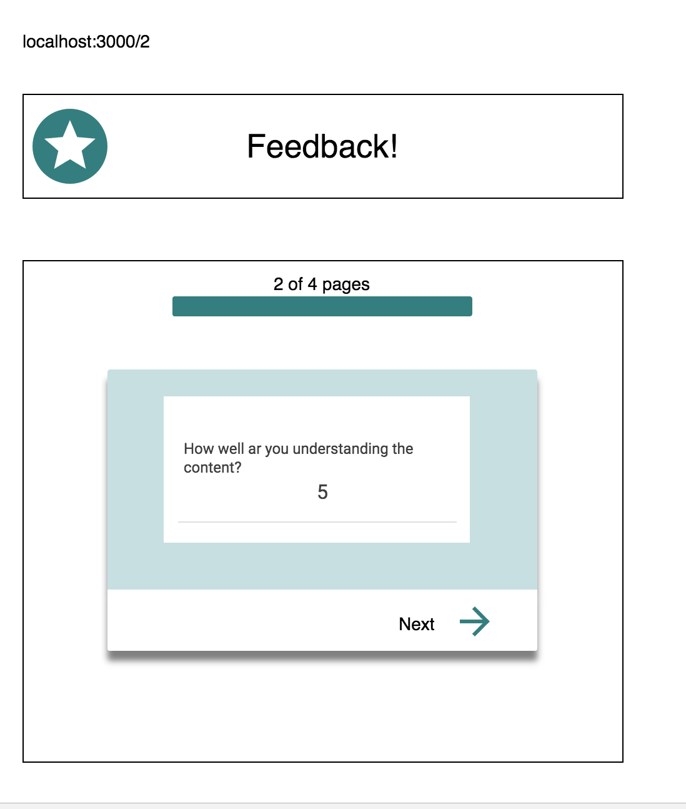
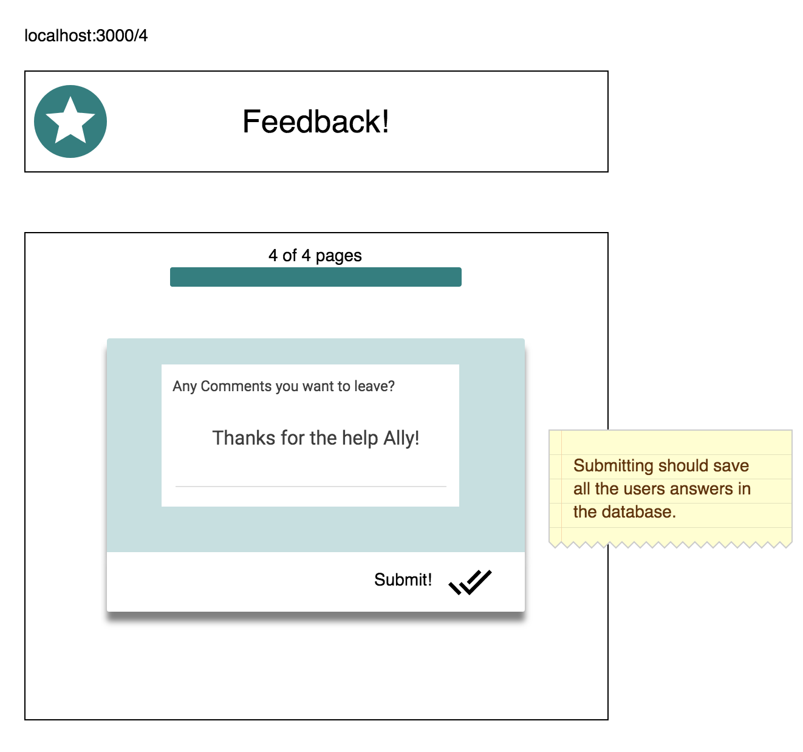

# Redux Feedback Loop

A feedback form modeled after Prime Digital Academy's daily feedback system. Feedback will be collected over 4 views, and when all steps are complete, the app saves feedback in the database. In a separate view, a user can see all collected feedback. 

### Built With
- Express
- Node
- PostgreSQL
- React
- Redux
- Saga


### SETUP

Create the database and tables using the provided `data.sql` file. Start the server.

```
npm install
npm run server
```

Now that the server is running, open a new terminal tab with `cmd + t` and start the react client app.

```
npm run client
```
## To-Do
### ADD NEW FEEDBACK

- [ ] Use Redux to store data across views.
- [x] Create a 4-part form that allows users to leave feedback for today. 
The parts:
- [x] How are you feeling today?

- [ ] How well are you understanding the content?

- [ ] How well are you being supported?

- [ ] Any comments you want to leave?


Logic
- [ ] Each part of the form should be at its own route. 
- [ ] Clicking next should move the user to the following view / step in the process.

- [ ] When the form is complete, save the submission in the database. 
- [ ] Display a submission success page on the DOM.
 

### DISPLAY FEEDBACK

- [ ] Display all of the existing feedback at the route `/admin`. 
- [ ] The most recently added feedback should appear at the top of the list. 
- [ ] Allow the user to delete existing feedback. 
 - [ ] Prompt the user to confirm prior to deleting the feedback from the database.


## Next Steps

- [ ] Improve the styling of the app using Material-UI theme, cards, snackbars, buttons, nav bar, and icons.
- [ ] Add the ability to flag an existing feedback entry for further review on the /admin view
- [ ] Deploy to Heroku -- will need to read the special instructions for building and deploying with these apps.

## Authors
Kyra Crawford Calvert


